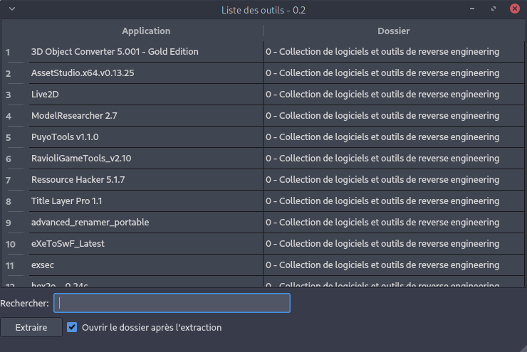

# MyToolBooxList

Un petit utilitaire graphique qui permet de sélectionner des logiciels compressés en zip. Afin que le programme original soit toujours intact. Lorsqu'un logiciel est choisi, l'utilitaire décompresse le logiciel choisi dans un dossier temporaire puis affiche ce dossier. 